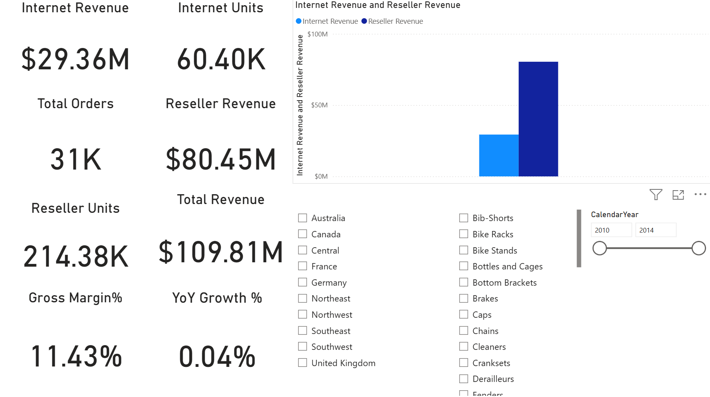
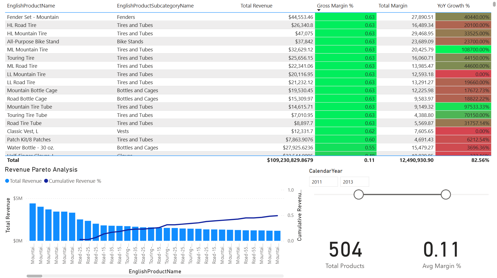
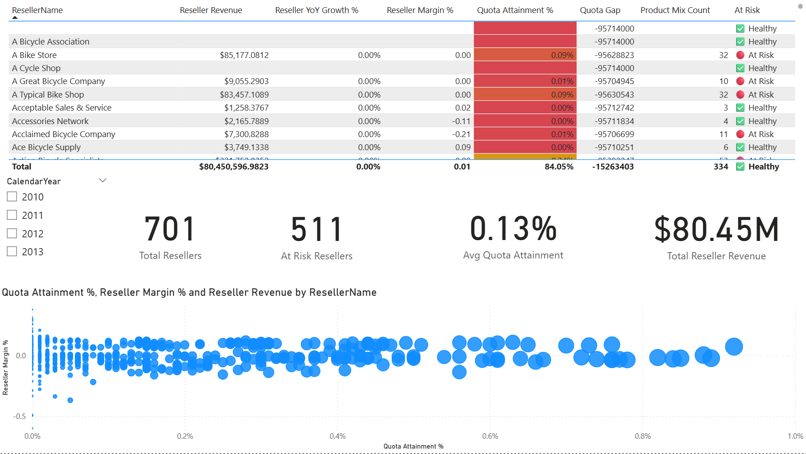

# 📊 Sales Performance & Reseller Analysis Dashboard

A Power BI report that analyzes multi-year retail sales data to find revenue concentration across products and flag underperforming resellers.

[](LICENSE)
[](https://www.microsoft.com/en-us/power-platform/products/power-bi/desktop)

> This repository holds the source `.pbix` file. To interact with the report itself (filters, drill-throughs), download it and open it in Power BI Desktop.

## Dashboard preview



The executive overview page: total revenue, the Internet vs. reseller revenue split, gross margin, YoY growth, and slicers by geography and product category.

## Problem

Sales and channel teams need one view that separates online revenue from reseller (partner) revenue, shows which products actually drive that revenue, and flags which resellers are falling short of quota. Spreadsheet reporting made all three hard to see at once.

## Approach

I built a three-page Power BI report on a star schema, using Power Query to clean the raw tables and standardize currency and date formats. The report has an executive overview page, a product Pareto analysis page, and a reseller risk page. The one notable choice was writing the Pareto cumulative percentage and the reseller "at risk" status as DAX measures rather than pre-computed columns, so both stay correct as the year and geography slicers change instead of being fixed at load time.

## Results

All figures below come from this report against the data already loaded into it (see Validation and limitations for what that data is).

| Metric | Value | Condition |
|---|---|---|
| Total revenue | $109.81M | All channels, calendar years 2010 to 2014 |
| Reseller revenue | $80.45M | All resellers, calendar years 2010 to 2014 |
| Internet revenue | $29.36M | Calendar years 2010 to 2014 |
| Gross margin | 11.43% | All channels, calendar years 2010 to 2014 |
| Resellers flagged "At Risk" | 511 of 701 (73%) | Reseller risk page, quota-attainment threshold logic, no year filter applied |





## How it works

- **Star schema**: `FactResellerSales` and `FactInternetSales` at the center, joined to `DimProduct`, `DimReseller`, `DimDate`, and `DimGeography`.
- **ETL**: Power Query cleans the raw tables and standardizes currency and date fields before they reach the model.
- **Measures layer**: DAX measures compute YoY growth, the Pareto running total and cumulative percentage, and reseller status, so the visuals recompute for any slicer combination rather than reading a value fixed at load time.
- **Report pages**: executive overview, then product Pareto analysis, then reseller risk, each read by the same `DimDate` and `DimGeography` slicers.
- **Interactivity**: a shared `CalendarYear` slicer and geography and category filters apply across pages, so narrowing one page's filter changes what the others show.

## Reproduce it

```
git clone https://github.com/willbebettertoday/sales-reseller-analysis-powerbi.git
cd sales-reseller-analysis-powerbi
```

Open `Sales Analysis Dashboard.pbix` in [Power BI Desktop](https://www.microsoft.com/en-us/power-platform/products/power-bi/desktop) (free). The file is about 11 MB, which is consistent with the data being imported into the file rather than loaded through a live connection, so it should open directly without a separate data source to configure.

## Validation and limitations

- The data behind this report is the **AdventureWorks** sample dataset. The `FactResellerSales` / `FactInternetSales` / `DimProduct` / `DimReseller` / `DimDate` / `DimGeography` tables, reseller names such as "A Bicycle Association" and "A Bike Store", and the bike-parts product catalog are all from that sample. The Pareto concentration and the reseller-health numbers above are statements about that sample dataset, not about a real business.
- Several measures on these pages produce values that look like artifacts of the sample's placeholder quota figures and of the year filter rather than real findings, and I have not corrected them. The sharpest example is the reseller risk page, where the Total row reports Quota Attainment of 84.05% while the KPI card directly below it reports 0.13% for the same measure, a roughly 600-fold gap on one screen; the same page also carries individual "Quota Gap" values in the tens of millions and an aggregate "Healthy" status despite 511 of 701 resellers being flagged "At Risk" individually, which together suggest the quota figures are placeholders rather than realistic targets. On the Pareto page, YoY Growth % runs as high as 108700%, which is what a year-over-year comparison produces when the CalendarYear slider (2011 to 2013) leaves almost no prior-year baseline inside the filtered context. That same slider, set to 2011-2013 on the Pareto page against 2010-2014 on the executive overview page, is also why the two pages' revenue totals do not reconcile exactly ($109,230,829 against $109.81M).
- I did not test this report against a live or refreshed data source. It has only been checked against the data already imported into the `.pbix` file.
- There is no automated test for a Power BI report. Validation here is limited to visually checking the three pages against the numbers quoted above.

## Tech stack

- Microsoft Power BI Desktop
- Power Query (ETL)
- DAX

**Data model**: star schema.
- Fact tables: `FactResellerSales`, `FactInternetSales`.
- Dimension tables: `DimProduct`, `DimReseller`, `DimDate`, `DimGeography`.

**Key DAX measures**:
- `YoY Growth %` = `(Current Sales - Previous Year Sales) / Previous Year Sales`
- `Pareto Cumulative %` = `DIVIDE(Running Total, Total Sales)`
- Dynamic segmentation logic for Reseller Status.

## Project structure

- `README.md` - this file.
- `LICENSE` - MIT license.
- `.gitignore` - excludes local Windows folder metadata and Power BI temp files.
- `Sales Analysis Dashboard.pbix` - the Power BI report file.
- `executive_overview.png` - screenshot of the executive overview page.
- `pareto_analysis.png` - screenshot of the product Pareto analysis page.
- `reseller_risk.png` - screenshot of the reseller risk page.

## License

MIT. See [LICENSE](LICENSE).

---
Author: Danil Sysenko
